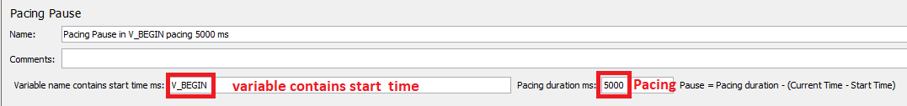
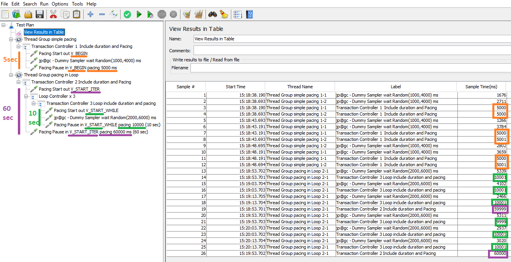

<p align="center">

  <p align="center">Apache JMeter Plugin to compute a pacing since thread start iteration or a variable contains start time</p>
  <p align="center"><a href="https://github.com/vdaburon/pacing-jmeter-plugin">Link to github project pacing-jmeter-plugin</a></p>
</p>


# pacing-jmeter-plugin
Add notion of Pacing for Apache JMeter.

## What is the Pacing in load testing ?
The Pacing in load testing is the **minimum time** before iterate.<br>
The Pacing is fixe but the waiting time to complete the pacing time is dynamic.<br>
Go to the FAQ for more explanations.

### Avantages of using Pacing
* The pacing is useful for performance testing when modeling for a user at what rate (cadence) he will perform business actions.
* With a pacing of 3 min, one user will perform 20 iterations per hour and 5 vusers 100 iterations per hour.<br>
* Pacing allows for fixed rates (cadence) to be maintained despite reasonable deteriorations in call response times.
* Pacing makes easier to model cadences for load increases with several steps (eg: 50%, 100%, 150%)


Examples:
* The sum of time durations for multi http requests is 6 sec and i set the pacing to 10 sec. The dynamic waiting time will be 4 sec to complete the pacing time (10 - 6 = 4).
* The sum of time durations for multi http requests is 8 sec and i set the pacing to 10 sec. The dynamic waiting time will be 2 sec to complete the pacing time (10 - 8 = 2).
* The sum of time durations for multi http requests is 12 sec and i set the pacing to 10 sec. The dynamic waiting time will be 0 sec because the minimum time has been exceeded.

## Pacing Sampler in JMeter GUI

The pacing plugin add 2 new Samplers
1. Pacing Start to save start time ms in a variable with System.currentTimeMillis()
2. Pacing Pause to get the start time from the previous variable and compute the dynamic waiting time to complete the Pacing Duration


### 1) Pacing Start Sampler
Declare a variable to save the start time (Variable value = System.currentTimeMillis())


### 2) Pacing Pause Sampler
Use the variable that contains the start time and compute the dynamic pause (waiting time) to complete the Pacing Duration. Pause = Pacing Duration - (Current Time - Start Time)<br>
Pause the thread for "Pause Computed" ms



## Demo a script with multi pacing samplers
A JMeter script contains 2 threads groups (Test Plan set "Run Thread Groups consecutively" to better understand the result).
1. The first thread group declare a single Pacing Start and a single Pacing Pause (5 sec).
2. The second thread group declare a Pacing Start at the begin of thread iteration and a Pacing Pause at the end of the script (60 sec) and a Pacing Start at the begin of a Loop and a Pacing Pause at the end of the Loop (10 sec).

To simulate variable duration of Sampler we use "jp@gc - Dummy Sampler" with sleep Random.


Configuration for the first Pacing Pause. Use the variable V_BEGIN declare in the Pacing Start and the Pacing Pause Duration (5000 ms or 5 sec)


The View Results in Table to see sample time



In the View Results in Table, you see the Pacing to 5 sec (5000 ms) for the first thread group. The Pacing to 10 sec (10000 ms) for the Pacing in the Loop and Pacing 60 sec (60000 ms) for the thread iteration in the second Thread Group.

## RIP - Random Intervals Pacing
If you want to add some randomize (1sec to 3sec) to the Pacing Duration (5sec). You could add somme Random ms to the Duration like:
<pre>
${__groovy(5000+org.apache.commons.lang3.RandomUtils.nextInt(1000\,3000))}
</pre>


If the Pacing duration is declared in a variable (e.g:V_PACING_ITER), you could call this variable and add random ms like:
<pre>
${__groovy(Long.parseLong(vars.get("V_PACING_ITER"))+org.apache.commons.lang3.RandomUtils.nextInt(1000\,3000))}
</pre>

## Plugin installed with jmeter-plugins-manager
This plugin could be installed with the jmeter-plugins-manager from jmeter.plugins.org.<br>
The plugin name is : "vdn@github - pacing-jmeter-plugin"

The default variable name could be set with property <code>pacing.default_variable_name</code> usually in user.properties or jmeter.properties.

E.g:
<pre>
pacing.default_variable_name=V_START_ITERATION
</pre>

The default pacing duration could be set with property <code>pacing.default_duration_ms</code> in user.properties or jmeter.properties.

E.g:
<pre>
pacing.default_duration_ms=60000
</pre>

## Usage Maven
The maven groupId, artifactId and version, this plugin is in the **Maven Central Repository** [](https://maven-badges.herokuapp.com/maven-central/io.github.vdaburon/pacing-jmeter-plugin)

```xml
<groupId>io.github.vdaburon</groupId>
<artifactId>pacing-jmeter-plugin</artifactId>
<version>1.0</version>
```
## F.A.Q

_Question 1) It sounds like Pacing mechanism in LR, but your plugin is much complicated. Instead of just set the pacing time, we have to add 2 different elements + set specific variable to use that._<br/>
Answer : In LR, you just set the pacing time because LR know when the iteration start. With JMeter the thread start iteration is not yet saved. I proposed a Pull Request [Add new thread variable __jmv_THREAD_START_TIME_ITERATION contains the currentTimeMillis when the thread iteration start](https://github.com/apache/jmeter/pull/6356) for Apache JMeter to add a new variable named "__jmv_THREAD_START_TIME_ITERATION" to save the thread start iteration. So you will no more need the first "Pacing Start" and use directly the "Pacing Pause" with variable "__jmv_THREAD_START_TIME_ITERATION".<br/>
The default variable name could be "__jmv_THREAD_START_TIME_ITERATION" when Apache JMeter (v6.0 and sup) include the code of the Pull Request 6356. The default name is set with property <code>pacing.default_variable_name</code>.

_Question 2) Why you decide to use samplers instead of timer ?_<br/>
Answer : Timers are **pre processors** not post processors so you can't compute the dynamic waiting time before alls samplers are finished.<br>
The template was "Flow Control Action : Pause" a sampler not a timer. Visually use samplers at the same level of others samplers, you see more easily the Pacing Start and the Pacing Pause.

_Question 3) JMeter already has “Constant Throughput Timer” that is the same as pacing. You have to set "number operations per minute" instead of "seconds between operations", but it changes nothing._<br/>
Answer : “number operations per minute” and “seconds between operations” are not the same if you have conditionals call in the script.<br>
<br/>
E.g: 60% of iterations, the "IF" is true and "HTTP Request 3" + "HTTP Request 4" are call - Total number of requests is **5**. 40% of iterations the "IF" is false - Total number of request is only **3**.<br/>
If you use a "Constant Throughput Timer" (number operations per minute) the result depends a lot on the "IF" condition.<br/>
If you use a "Pacing Duration" the duration is the same and not depends on "IF" condition.<br/>
Pacing makes easier to model cadences for load increases with several steps (eg: 50%, 100%, 150%). When you double the number of vusers with Pacing you double the load. It's not the same behaviour for "Constant Throughput Timer"<br/>
<br/>
For a Stepping Thread Group configured with 3 steps.<br/>


Result : Transactions per sec correspond exactly to the 3 steps declared in the Stepping Thread Group. Remark : The ramp up time = Pacing Duration = 4 sec<br/>


_Question 4) For the pacing is usually use groovy samplers and this plugin does the same as my groovy script, why create a new plugin ?_<br/>
Answer : It's true. Before this plugin, i use a first groovy sampler to save the start time and at the end of the script i add a groovy sampler to compute the dynamic wait time to complete the Pacing duration. And i add a "Flow Control Action : Pause" with value contains the computed wait time.<br/>
This plugin remplace this 2 Groovy Samplers and the Flow Control Action. It's more visual to see the 2 dedicated samplers "Pause Start" and "Pacing Pause" then 2 samplers JSR223 Groovy en particular if you have multi groovy samplers in the script.

_Question 5) Does this plugin only for Thread Iteration Pacing Duration ?_<br/>
Anwser : No, this plugin is for Thread Iteration Pacing Duration and also for Pacing in a Loop.<br/>
E.g: In you script you have a login, a loop (x 10) contains multi-calls, a logout. You can add a "Pacing Start in the begin of the Loop and the end of the Loop add a "Pacing Pause". The Pacing is computed for the Loop Iteration without the login and logout of the thread iteration.

## Limitation
The main limitation of this Pacing Plugin is the Sampler Pause could be not call because an error occurred and the Thread Group is configured with "Start Next Thread Loop" on error.

There is no simple solution to guarantee that Pacing Pause will be called in all error cases. 

This notion of Pacing would have to be declared at the Thread Group level or there would have to be a way to intercept an error to direct it to a dedicated piece of code.

## License
Licensed under the Apache License, Version 2.0

## versions
Version 1.0 date 2024-09-27, First version.